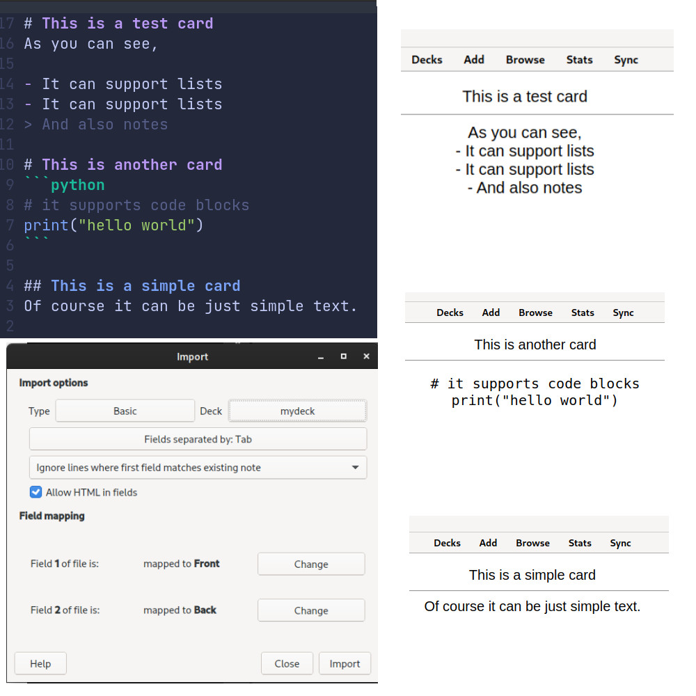

# Brilho 🌟
Brilho is a fast application that converts markdown files to Anki questions.

# Setup

## With Nix
```bash
nix run github:arcticlimer/brilho --target <directory>
```

## With cargo
```bash
cargo build --release
./target/release/brilho --target <directory>
```

# Usage
Currently brilho expects your markdown to be in a format similar to [that](./others/test.md)

Even though you don't follow this specific format, brilho tries its best to make
markdown written in a similar way to look nice as Anki cards.

## Showcase


After the `csv` file is generated, you can just go into Anki and import it in
the **Import** tab.
> Remember to enable HTML when importing

<!-- # Benchmarks -->

# Philosophy
- It should stick to supporting mainly common markdown files
- It should be fast and give you a chance to review its output
- It should be minimal and only convert markdown files into anki cards

# Planned features
- Syntax highlighting
- Images support
- LaTeX support
- URLs support
- Backlink support
- Use nested headings context in generated cards

# Contributing
Feel free to open issues and pull requests!

If you want to help with development, you can access the Nix development
environment by running the `nix develop` command.
